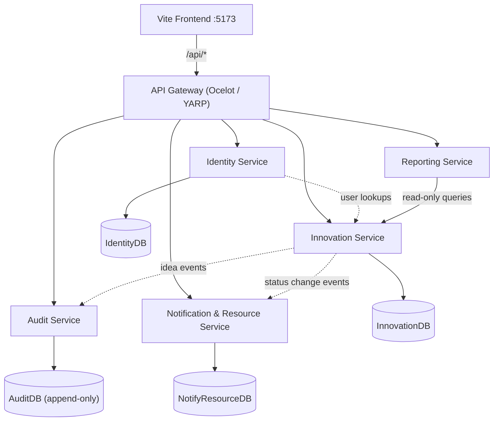
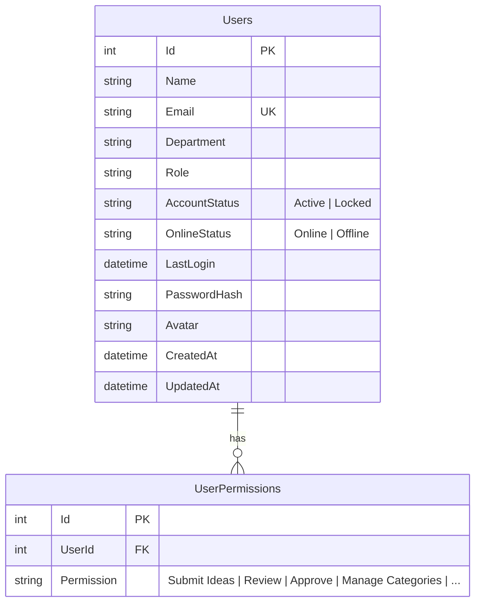
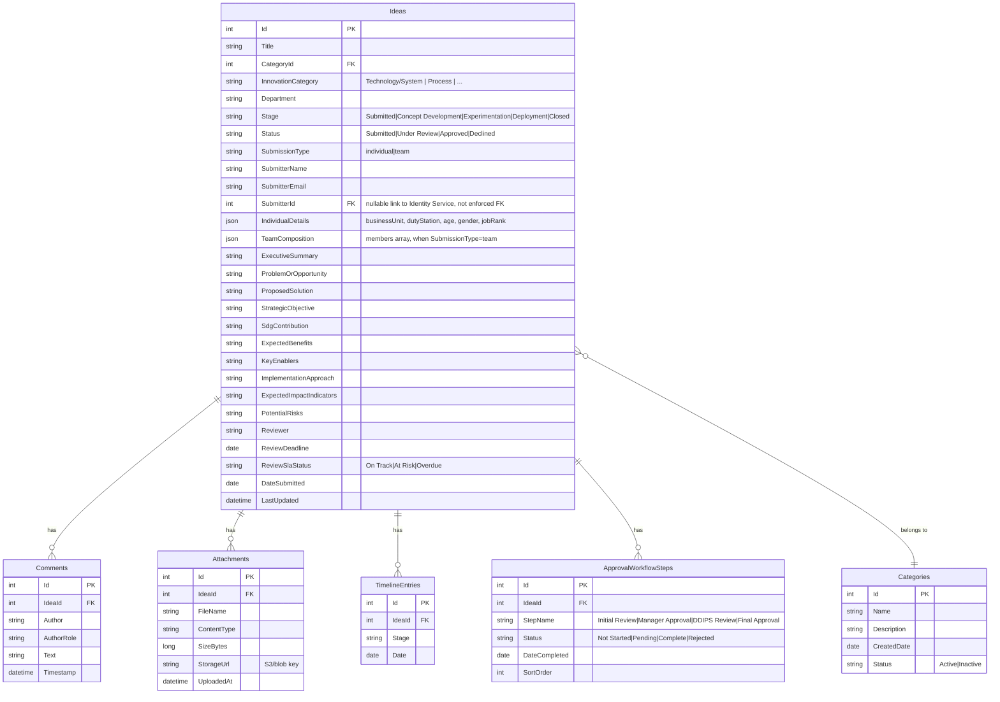
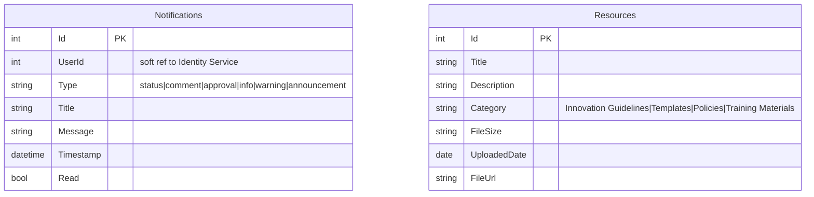
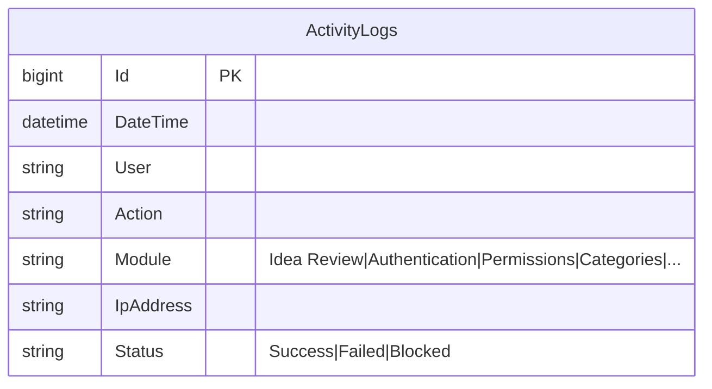
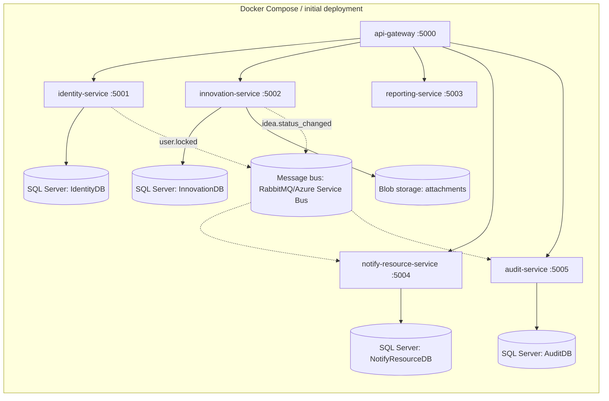

# Bank of Uganda IMTS — Backend Architecture Design

**Status:** Design proposal, not yet implemented
**Target stack:** ASP.NET Core 8, API Gateway pattern, per-service SQL databases
**Companion docs in repo:** `docs/BACKEND_INTEGRATION.md`, `docs/API_MAPPING.md`, `docs/DATA.md`

This document is written directly against the real shape of `data/*.json` (which is richer
than `docs/DATA.md` implies — e.g. ideas carry `individual`/`teamComposition` objects,
`progressStages`, `reviewSlaStatus`) so the schema and contracts below won't require
rework once implementation starts.

---

## 1. Design goals

1. **Zero UI rewrite.** Every `services/*.js` file keeps its current function signatures
   (`getIdeas()`, `saveUsers()`, etc.) — only the fetch target changes from `/data/*.json`
   to `/api/*`. This was already the explicit intent in `docs/API_MAPPING.md`.
2. **One public entry point.** Frontend never talks to a microservice directly — always
   `/api/*` through the Gateway.
3. **Stateless services.** Auth via JWT, no server-side session store, so services scale
   horizontally without sticky sessions.
4. **Service boundaries follow the data's natural ownership**, not the current file split
   (e.g. Notifications and Resources are simple enough to share a service rather than each
   getting a dedicated one — see §2 rationale).
5. **Incremental cutover.** Each service can go live independently; the frontend already
   fetches per-resource, so Ideas can move to a real API while Users is still JSON.

---

## 2. Service boundaries

| # | Service | Owns | Rationale |
|---|---------|------|-----------|
| 1 | **API Gateway** | Routing, JWT verification, rate limiting, CORS, request logging | Single ingress; per BACKEND_INTEGRATION.md |
| 2 | **Identity Service** | `Users`, `Roles`, `Permissions`, login, AD integration | Security-sensitive — isolated on purpose |
| 3 | **Innovation Service** | `Ideas`, `Comments`, `Attachments`, `Timeline`, `ApprovalWorkflow`, `Categories` | These are one aggregate: an Idea is never read/written without its comments/timeline/workflow, so splitting "Idea" from "Workflow" (as the README sketch suggests) would mean chatty cross-service calls for almost every screen. Categories is small reference data with the same lifecycle owner (Innovation Team), so it rides along. |
| 4 | **Reporting Service** | Read-only aggregation over Innovation Service data, CSV/PDF/Excel export | Heavy, bursty workload (report generation) — isolated so it can scale/queue independently without affecting the write path |
| 5 | **Notification & Resource Service** | `Notifications`, `Resources` | Both are simple, low-write, read-mostly reference/inbox data with no complex business logic — combining avoids two near-empty services |
| 6 | **Audit Service** | `ActivityLogs` | Write-heavy, append-only, different retention/compliance rules than everything else (BoU will likely want immutable audit storage) |

This collapses the README's original 5-box sketch into 6 concrete services, merging where
the data has no independent lifecycle and splitting where compliance/scaling needs differ.



Each service owns its own database — no cross-service joins, no shared schema. Cross-service
reads (e.g. Reporting needing submitter names) go through the Innovation Service's read
endpoints or a denormalized `submitterName`/`submitterEmail` snapshot stored on the Idea
itself (which the current JSON already does — see `ideas.json`).

---

## 3. Database design

### 3.1 Identity Service — `IdentityDB`



`Role` stays a simple string enum (`Staff`, `Innovation Manager`, `Innovation Officer`,
`IT Admin`) matching what's already in `users.json`, rather than a separate `Roles` table —
there's no evidence in the current data of role-specific metadata beyond the label and its
permission set, so a join table would be premature normalization.

### 3.2 Innovation Service — `InnovationDB`



Notes:
- `IndividualDetails` / `TeamComposition` are stored as JSON columns rather than normalized
  tables — they're free-form, submission-type-dependent blobs that are never queried by
  individual sub-field in the current UI (only displayed), so normalizing them adds schema
  churn for no query benefit. Revisit only if reporting needs to filter by e.g. `age` bracket.
- `progressStages` in the current JSON is **derived**, not stored — it's a client-computed
  view over `Stage` + a fixed 5-stage sequence (`Submitted → Concept Development →
  Experimentation → Deployment → Closed`). The API should compute and return it rather than
  persist it, to avoid the two ever drifting out of sync.
- `SubmitterId` is a soft reference to Identity Service (no cross-DB foreign key) — kept in
  sync at write time and denormalized (`SubmitterName`, `SubmitterEmail`) for fast reads
  without a service call.

### 3.3 Notification & Resource Service — `NotifyResourceDB`



### 3.4 Audit Service — `AuditDB` (append-only, no updates/deletes)



`ActivityLogs` is written to by every other service via an internal event (not a direct
DB write), so the Audit Service is the only writer to its own table — this preserves
tamper-evidence, which BoU (as a central bank) will likely require for compliance.

---

## 4. REST API contracts

All routes are exposed through the Gateway as `/api/...`. Internal-only service ports are
never reachable from the frontend.

Conventions used throughout:
- Auth: `Authorization: Bearer <JWT>` header, required unless marked **Public**.
- Errors: uniform envelope (see §6.1).
- Lists: paginated (see §6.2) unless marked **Not paginated**.

### 4.1 Identity Service

| Method | Route | Auth | Body | Response | Notes |
|---|---|---|---|---|---|
| POST | `/api/auth/login` | Public | `{ email, password }` | `{ token, refreshToken, user }` | Validates against AD in production; local table in interim |
| POST | `/api/auth/refresh` | Public (refresh token) | `{ refreshToken }` | `{ token, refreshToken }` | Rotates refresh token |
| POST | `/api/auth/logout` | Bearer | — | `204` | Revokes refresh token server-side |
| POST | `/api/auth/forgot-password` | Public | `{ email }` | `202` | Always returns 202 regardless of whether email exists (avoid user enumeration) |
| POST | `/api/auth/reset-password` | Public (reset token) | `{ token, newPassword }` | `204` | |
| GET | `/api/users` | Bearer, role: `IT Admin` | `?search=&page=&pageSize=` | `PagedResult<User>` | |
| GET | `/api/users/{id}` | Bearer | — | `User` | Self or Admin only |
| PUT | `/api/users/{id}` | Bearer, role: `IT Admin` | `{ accountStatus?, permissions?, role? }` | `User` | Locks/unlocks, permission edits |
| PUT | `/api/users/me/password` | Bearer | `{ currentPassword, newPassword }` | `204` | Change-password page |

**`User` shape (response):**
```json
{
  "id": 3,
  "name": "Brian Ssempijja",
  "email": "brian@bou.or.ug",
  "department": "Information Technology",
  "role": "Staff",
  "accountStatus": "Active",
  "onlineStatus": "Online",
  "lastLogin": "2026-07-14T09:30:00Z",
  "permissions": ["Submit Ideas", "View Resources"],
  "avatar": "BS"
}
```

**Login response:**
```json
{
  "token": "eyJhbGciOi...",
  "refreshToken": "8f14e45f...",
  "expiresIn": 3600,
  "user": { "...": "User shape above" }
}
```

### 4.2 Innovation Service

| Method | Route | Auth | Body | Response | Notes |
|---|---|---|---|---|---|
| GET | `/api/ideas` | Bearer | `?status=&stage=&category=&department=&search=&page=&pageSize=` | `PagedResult<IdeaSummary>` | Staff see only their own (`submitterEmail == currentUser.email`); Innovation Team/Admin see all — **enforced server-side**, not by the frontend |
| GET | `/api/ideas/{id}` | Bearer | — | `IdeaDetail` (full object incl. comments/timeline/workflow) | 403 if a Staff user requests someone else's idea |
| POST | `/api/ideas` | Bearer, role: `Staff` | `IdeaCreateRequest` | `IdeaDetail`, `201` | Creates with `Stage=Submitted`, `Status=Submitted` |
| PUT | `/api/ideas/{id}` | Bearer | Partial `{ status?, stage?, ...fields }` | `IdeaDetail` | Staff: only own idea, only while `Stage=Submitted` (draft-style edit). Innovation Team: status/stage/workflow transitions. Enforced via role + ownership check, not just UI hiding buttons |
| DELETE | `/api/ideas/{id}` | Bearer, role: `Staff` (owner) | — | `204` | Retract/cancel — only while `Stage=Submitted` |
| POST | `/api/ideas/{id}/comments` | Bearer | `{ text }` | `Comment`, `201` | `author`/`authorRole` taken from JWT claims, not client input |
| POST | `/api/ideas/{id}/attachments` | Bearer (owner or reviewer) | `multipart/form-data` | `Attachment`, `201` | Streams to blob storage, returns metadata |
| GET | `/api/ideas/{id}/attachments/{attachmentId}` | Bearer | — | binary stream | Signed URL or proxied download |
| PUT | `/api/ideas/{id}/workflow/{stepName}` | Bearer, role: `Innovation Team` | `{ status, dateCompleted? }` | `IdeaDetail` | Enforces sequential step order server-side (see §4.4) |
| GET | `/api/categories` | Bearer | — | `Category[]` — **Not paginated** | Small reference list |
| POST | `/api/categories` | Bearer, role: `Innovation Team` | `{ name, description }` | `Category`, `201` | |
| PUT | `/api/categories/{id}` | Bearer, role: `Innovation Team` | `{ name?, description?, status? }` | `Category` | |
| DELETE | `/api/categories/{id}` | Bearer, role: `Innovation Team` | — | `204` | Soft-delete (`status=Inactive`) if referenced by any idea, hard-delete otherwise |

**`IdeaSummary` (list view — lighter than detail):**
```json
{
  "id": 1,
  "title": "Digital Currency Wallet",
  "category": "FinTech",
  "department": "Information Technology",
  "stage": "Concept Development",
  "status": "Under Review",
  "submitterName": "Brian Ssempijja",
  "dateSubmitted": "2025-07-10T00:00:00Z",
  "lastUpdated": "2025-07-14T00:00:00Z",
  "reviewSlaStatus": "At Risk"
}
```

**`IdeaDetail`** = `IdeaSummary` + `executiveSummary`, `problemOrOpportunity`,
`proposedSolution`, `strategicObjective`, `sdgContribution`, `expectedBenefits`,
`keyEnablers`, `implementationApproach`, `expectedImpactIndicators`, `potentialRisks`,
`individual`/`teamComposition`, `attachments[]`, `comments[]`, `timeline[]`,
`approvalWorkflow[]`, and a server-computed `progressStages[]` (see §3.2 notes).

### 4.3 Reporting Service

| Method | Route | Auth | Body/Query | Response | Notes |
|---|---|---|---|---|---|
| GET | `/api/reports/summary` | Bearer, role: `Innovation Team`/`IT Admin` | `?dateFrom=&dateTo=&department=&category=` | `{ totalIdeas, byStage, byStatus, byCategory, byDepartment, slaBreaches }` | Powers dashboard charts (replaces "Chart Placeholder" divs) |
| GET | `/api/reports/export` | Bearer, role: `Innovation Team`/`IT Admin` | `?format=csv\|xlsx\|pdf&...same filters` | file stream | `202` + polling `GET /api/reports/export/{jobId}` for pdf/xlsx if generation is async (>2s) |

Reporting Service holds **no primary data** — it queries Innovation Service's database via
a read replica or a set of internal read-only endpoints (`/internal/ideas/aggregate`) not
exposed through the Gateway. This keeps the write path (Innovation Service) insulated from
report-generation load.

### 4.4 Notification & Resource Service

| Method | Route | Auth | Body | Response | Notes |
|---|---|---|---|---|---|
| GET | `/api/notifications` | Bearer | `?unreadOnly=&page=&pageSize=` | `PagedResult<Notification>` | Scoped to current user via JWT `sub` claim |
| PUT | `/api/notifications/{id}/read` | Bearer | — | `204` | |
| PUT | `/api/notifications/read-all` | Bearer | — | `204` | |
| GET | `/api/resources` | Bearer | `?category=&search=` | `Resource[]` — **Not paginated** | Small reference list |

### 4.5 Audit Service

| Method | Route | Auth | Body | Response | Notes |
|---|---|---|---|---|---|
| GET | `/api/activities` | Bearer, role: `IT Admin` | `?module=&user=&status=&dateFrom=&dateTo=&page=&pageSize=` | `PagedResult<ActivityLog>` | Read-only from outside; writes happen only via internal event consumers |

---

## 5. Auth & authorization design

### 5.1 JWT claims

```json
{
  "sub": "3",
  "email": "brian@bou.or.ug",
  "name": "Brian Ssempijja",
  "role": "Staff",
  "permissions": ["Submit Ideas", "View Resources"],
  "department": "Information Technology",
  "iat": 1752480000,
  "exp": 1752483600,
  "iss": "imts-identity-service",
  "aud": "imts-gateway"
}
```

- Access token: 60 min expiry, signed with an asymmetric key (RS256) so the Gateway and
  every downstream service can verify signatures with a public key without calling
  Identity Service on every request.
- Refresh token: opaque random string, 14-day expiry, stored server-side (hashed) so it can
  be revoked on logout or password change — stored in `localStorage` alongside the access
  token in the existing `bou_current_user` shape, matching what `docs/BACKEND_INTEGRATION.md`
  already specifies.

### 5.2 Where authorization is enforced

The current frontend already hides buttons/routes by role (`permissions.js`), but that is
**not security** — it's UX. Every state-changing endpoint above re-checks role and
ownership server-side. Concretely:

- **Gateway layer**: verifies JWT signature/expiry, rejects malformed/expired tokens before
  they reach a service (`401`).
- **Service layer**: each service has its own `[Authorize(Roles = "...")]` policy per
  endpoint (`403` if role insufficient) plus explicit ownership checks in the handler where
  role alone isn't enough (e.g. a Staff user can only edit *their own* idea, not just any
  idea — role check passes but ownership check fails otherwise).
- **Workflow step ordering**: `PUT /api/ideas/{id}/workflow/{stepName}` validates that the
  prior step in `ApprovalWorkflowSteps` (by `SortOrder`) is already `Complete` before
  allowing a step to move to `Complete` — this is the "state transition flow checks"
  responsibility called out in `docs/BACKEND_INTEGRATION.md` §3.

### 5.3 Role → permission matrix (derived from `users.json` + `docs/PAGE_DOCUMENTATION.md`)

| Action | Staff | Innovation Officer | Innovation Manager | IT Admin |
|---|:---:|:---:|:---:|:---:|
| Submit idea | ✅ | ❌ | ❌ | ❌ |
| Edit/retract own idea (while `Submitted`) | ✅ | ❌ | ❌ | ❌ |
| View all ideas | ❌ (own only) | ✅ | ✅ | ✅ |
| Comment on idea | ✅ (own) | ✅ | ✅ | ❌ |
| Change idea stage/status | ❌ | ✅ | ✅ | ❌ |
| Manage categories | ❌ | ❌ | ✅ | ❌ |
| Manage permissions | ❌ | ❌ | ✅ | ❌ |
| View reports/exports | ❌ | ✅ | ✅ | ✅ |
| Manage users (lock/unlock) | ❌ | ❌ | ❌ | ✅ |
| View activity logs | ❌ | ❌ | ❌ | ✅ |

This table should live in code as a policy table (not scattered `if role ==` checks) so
it's auditable in one place — e.g. an ASP.NET Core `AuthorizationPolicyProvider` keyed off
the `permissions` claim array already in the JWT, rather than the coarser `role` string.

---

## 6. Cross-cutting concerns

### 6.1 Error envelope (all services, enforced at Gateway too)

```json
{
  "error": {
    "code": "IDEA_NOT_FOUND",
    "message": "No idea exists with id 42.",
    "traceId": "00-4bf92f3577b34da6a3ce929d0e0e4736-00"
  }
}
```
- `traceId` matches the `X-Correlation-Id` header propagated from Gateway → service, so a
  single failed request can be traced across logs.
- HTTP status still carries the primary signal (`404`, `403`, `422`, etc.); `code` is for
  the frontend to branch on user-facing copy without string-matching `message`.

### 6.2 Pagination envelope

```json
{
  "items": [ "..." ],
  "page": 1,
  "pageSize": 20,
  "totalItems": 143,
  "totalPages": 8
}
```
Applied to `GET /api/ideas`, `GET /api/users`, `GET /api/notifications`,
`GET /api/activities`. Small reference lists (`categories`, `resources`) skip pagination —
they're bounded by nature (a handful of categories, dozens of resources at most).

### 6.3 Observability

- Structured JSON logs (Serilog) with `traceId`, `userId`, `route`, `durationMs` on every
  request.
- Gateway emits request-count/latency/error-rate metrics per downstream route — this is
  where the "SLA breach" reporting on the dashboard should eventually be cross-checked
  against actual system health, not just business SLA (`reviewSlaStatus`).

### 6.4 Rate limiting

Applied at the Gateway only (not per-service, to avoid inconsistent limits):
- `POST /api/auth/login`: 5 requests / minute / IP (brute-force protection)
- All other authenticated routes: 100 requests / minute / user

---

## 7. Gateway configuration sketch (Ocelot, ASP.NET Core)

```json
{
  "Routes": [
    {
      "UpstreamPathTemplate": "/api/auth/{everything}",
      "DownstreamPathTemplate": "/auth/{everything}",
      "DownstreamHostAndPorts": [{ "Host": "identity-service", "Port": 5001 }]
    },
    {
      "UpstreamPathTemplate": "/api/users/{everything}",
      "DownstreamPathTemplate": "/users/{everything}",
      "DownstreamHostAndPorts": [{ "Host": "identity-service", "Port": 5001 }],
      "AuthenticationOptions": { "AuthenticationProviderKey": "Bearer" }
    },
    {
      "UpstreamPathTemplate": "/api/ideas/{everything}",
      "DownstreamPathTemplate": "/ideas/{everything}",
      "DownstreamHostAndPorts": [{ "Host": "innovation-service", "Port": 5002 }],
      "AuthenticationOptions": { "AuthenticationProviderKey": "Bearer" }
    },
    {
      "UpstreamPathTemplate": "/api/categories/{everything}",
      "DownstreamPathTemplate": "/categories/{everything}",
      "DownstreamHostAndPorts": [{ "Host": "innovation-service", "Port": 5002 }],
      "AuthenticationOptions": { "AuthenticationProviderKey": "Bearer" }
    },
    {
      "UpstreamPathTemplate": "/api/reports/{everything}",
      "DownstreamPathTemplate": "/reports/{everything}",
      "DownstreamHostAndPorts": [{ "Host": "reporting-service", "Port": 5003 }],
      "AuthenticationOptions": { "AuthenticationProviderKey": "Bearer" }
    },
    {
      "UpstreamPathTemplate": "/api/notifications/{everything}",
      "DownstreamPathTemplate": "/notifications/{everything}",
      "DownstreamHostAndPorts": [{ "Host": "notify-resource-service", "Port": 5004 }],
      "AuthenticationOptions": { "AuthenticationProviderKey": "Bearer" }
    },
    {
      "UpstreamPathTemplate": "/api/resources/{everything}",
      "DownstreamPathTemplate": "/resources/{everything}",
      "DownstreamHostAndPorts": [{ "Host": "notify-resource-service", "Port": 5004 }],
      "AuthenticationOptions": { "AuthenticationProviderKey": "Bearer" }
    },
    {
      "UpstreamPathTemplate": "/api/activities/{everything}",
      "DownstreamPathTemplate": "/activities/{everything}",
      "DownstreamHostAndPorts": [{ "Host": "audit-service", "Port": 5005 }],
      "AuthenticationOptions": { "AuthenticationProviderKey": "Bearer" }
    }
  ]
}
```

`/api/auth/login`, `/api/auth/forgot-password`, and `/api/auth/reset-password` are
explicitly excluded from the `AuthenticationOptions` block above (no token required yet).

---

## 8. Deployment topology (initial, single-region)



- Start as a `docker-compose` stack (one container per service + one per DB) for the pilot;
  each service is independently deployable to Azure Container Apps / AKS later without
  redesign, since they're already stateless behind the Gateway.
- Cross-service side effects (e.g. "notify the submitter when status changes," "log every
  auth event") go through a lightweight message bus rather than synchronous HTTP calls
  between services — this keeps Innovation Service from blocking on Notification/Audit
  service availability when a reviewer saves a status change.

---

## 9. Rollout mapping (ties back to the existing plan)

| Step | What ships | Frontend change required |
|---|---|---|
| 1 | Identity Service + Gateway, JWT login | `js/auth.js`: point `AuthSystem.login` at `/api/auth/login`; store token in `bou_current_user` (shape unchanged) |
| 2 | Innovation Service (Ideas, Comments, Categories) | `services/ideaService.js`, `services/categoryService.js`: swap `BASE_URL` per `docs/API_MAPPING.md` pattern, add `Authorization` header |
| 3 | Notification & Resource Service | `services/notificationService.js`, `services/resourceService.js`: same swap |
| 4 | Audit Service | `services/activityService.js`: same swap; also wire event consumers in Identity/Innovation services to publish audit events |
| 5 | Reporting Service | `js/reports.js`: replace chart-placeholder/export stubs with real `/api/reports/*` calls (this also closes TODO items #5 and #6) |

Each step is independently shippable and testable because the frontend's service layer is
already isolated — this was the one architectural decision in the existing prototype that
makes this whole plan low-risk.

---

## 10. Open decisions for BoU stakeholders (not assumed here)

- **Identity source of truth**: full AD/LDAP integration vs. a local `Users` table seeded
  from AD (recommend starting local, syncing from AD later — faster to pilot).
  Cannot verify Bank of Uganda's actual AD topology from this repo, so this is a placeholder.
- **File storage**: on-prem BLOB vs. cloud object storage for attachments — depends on BoU's
  data residency policy, which isn't documented anywhere in this repo.
- **Message bus choice**: RabbitMQ (self-hosted, simpler for a pilot) vs. Azure Service Bus
  (if BoU is already on Azure) — no evidence in the repo of existing cloud commitments.
